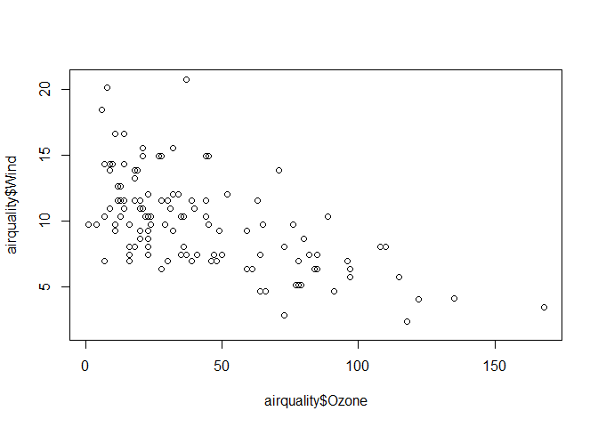

**Literate Statistical Programming with Knitr**    
==================================================

the idea of literate programming comes from Donald Knuth, who envisioned computer code and the documentation for that code existing together in a
single document.

For literate statistical programming, the idea is that a report is viewed as a stream of text and code. Analysis code is divided into code chunks with text surrounding the code chunks explaining what is going on. In general, literate programs are weaved to produce human-readable documents and tangled to produce machine- readable documents

The requirements for writing literate programs are a documentation language and a programming language. 

## How do i make wy work reproducible?

* decide to do it
* don´t save output (that is temporary)
* Use non-proprietary format (use text)

##  Pros of literate statistical programming  

* text and code all in one place, logical order.
* Data, results automatically updated
* code is live - you can modify it, detect errors

## Cons of literate statistical programming

* Sometimes difficult read 
* To see ir you need to run it (hard if the code is complex)

## **what is Knitr?**

* R package
* The language tha we will use is markdown

## **what is Markdown?**

* A simplified version of markup  langages (difficult to read)
* Markdown is easier

## **what is R Markdown?**

R markdown is the integration of R code with Markdown. Documents written in R Markdown have R coded nested inside of them, which allows one to to create documents containing “live” R code. 


*R markdown can be converted to standard markdown using the knitr package in R. Results from R code are inserted into Markdown document. Markdown can subsequently be converted to HTML using the markdown5 package in R, but you seldom have to call this package explicitly*

The use of R Markdown to create reproducible reports is now a core tool in literate statistical programming


```r
plot(airquality$Ozone,airquality$Wind)
```

<!-- -->
