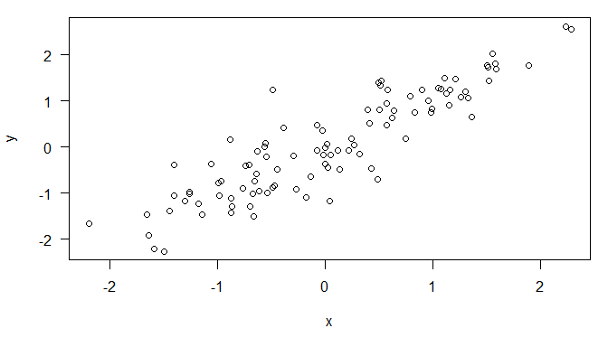

mEJOR FORMA DE GUARDAR MD CON IMAGENES
https://github.com/lgreski/datasciencectacontent/blob/master/markdown/repData-configuringKnitrWithMarkdownOutput.md


**Literate Statistical Programming with Knitr**    
==================================================

the idea of literate programming comes from Donald Knuth, who envisioned computer code and the documentation for that code existing together in a
single document.

For literate statistical programming, the idea is that a report is viewed as a stream of text and code. Analysis code is divided into code chunks with text surrounding the code chunks explaining what is going on. In general, literate programs are weaved to produce human-readable documents and tangled to produce machine- readable documents

The requirements for writing literate programs are a documentation language and a programming language. 

## How do i make wy work reproducible?

* decide to do it
* don´t save output (that is temporary)
* Use non-proprietary format (use text)

##  Pros of literate statistical programming  

* text and code all in one place, logical order.
* Data, results automatically updated
* code is live - you can modify it, detect errors

## Cons of literate statistical programming

* Sometimes difficult read 
* To see ir you need to run it (hard if the code is complex)

## **what is Knitr?**

* R package
* The language tha we will use is markdown

## **what is Markdown?**

* A simplified version of markup  langages (difficult to read)
* Markdown is easier

## **what is R Markdown?**

R markdown is the integration of R code with Markdown. Documents written in R Markdown have R coded nested inside of them, which allows one to to create documents containing “live” R code. 


*R markdown can be converted to standard markdown using the knitr package in R. Results from R code are inserted into Markdown document. Markdown can subsequently be converted to HTML using the markdown5 package in R, but you seldom have to call this package explicitly*

The use of R Markdown to create reproducible reports is now a core tool in literate statistical programming


echo False Notice that now the code is no longer in the document.


```
## [1] 0.04986247
```

you can also hide the results


## inline Text computation 


The current time is  lun. ene. 25 10:34:11 a. m. 2021. My favorite number is -0.0643484.

#PLots


```r
x <-  rnorm(100); y <- x + rnorm(100,sd =0.5)
```

with the option *fig.height*


```r
par(mar = c(5,4,1,1), las = 1)
plot(x,y)
```

<!-- -->

remember = fig.height, fig.width

#TAble 


```r
library(datasets)
data(airquality)
fit <- lm(Ozone ~ Wind + Temp + Solar.R, data = airquality)
```

Table of regression coefficients


```r
library(xtable)
```

```
## Warning: package 'xtable' was built under R version 4.0.3
```

```r
xt <- xtable(summary(fit))
print(xt, type = "html")
```

<!-- html table generated in R 4.0.2 by xtable 1.8-4 package -->
<!-- Mon Jan 25 10:34:11 2021 -->
<table border=1>
<tr> <th>  </th> <th> Estimate </th> <th> Std. Error </th> <th> t value </th> <th> Pr(&gt;|t|) </th>  </tr>
  <tr> <td align="right"> (Intercept) </td> <td align="right"> -64.3421 </td> <td align="right"> 23.0547 </td> <td align="right"> -2.79 </td> <td align="right"> 0.0062 </td> </tr>
  <tr> <td align="right"> Wind </td> <td align="right"> -3.3336 </td> <td align="right"> 0.6544 </td> <td align="right"> -5.09 </td> <td align="right"> 0.0000 </td> </tr>
  <tr> <td align="right"> Temp </td> <td align="right"> 1.6521 </td> <td align="right"> 0.2535 </td> <td align="right"> 6.52 </td> <td align="right"> 0.0000 </td> </tr>
  <tr> <td align="right"> Solar.R </td> <td align="right"> 0.0598 </td> <td align="right"> 0.0232 </td> <td align="right"> 2.58 </td> <td align="right"> 0.0112 </td> </tr>
   </table>


# Set global options 

Sometimes you want to set an option that applies to all chunks in your document. 


# in comlex code chunk

cache = TRUE

Chunk caching is one way to avoid these lengthy computations. By setting the cache = TRUE chunk option, what Using knitr for Reproducible Reports 77 knitr does is run the chunk once, then store the output in a database in your working directory. Then, when you re-knit the document, instead of running the code in that particular chunk, knitr simply re-loads the stored output from the database. 
